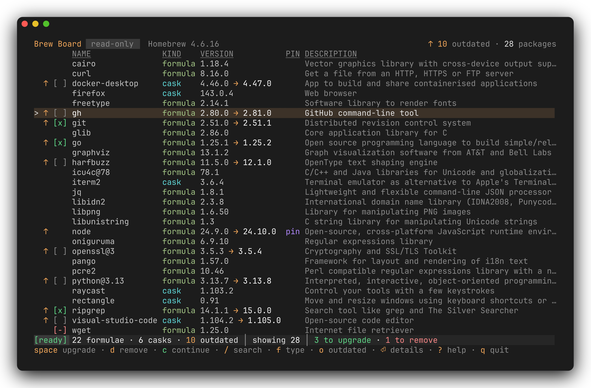
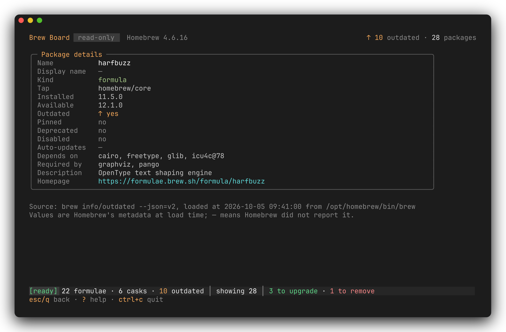
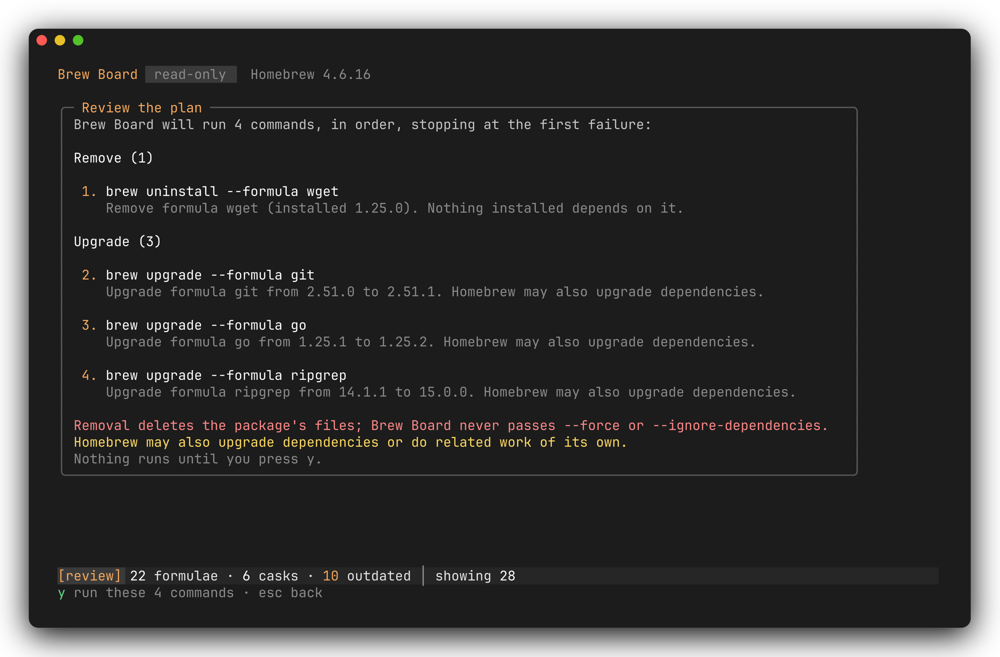
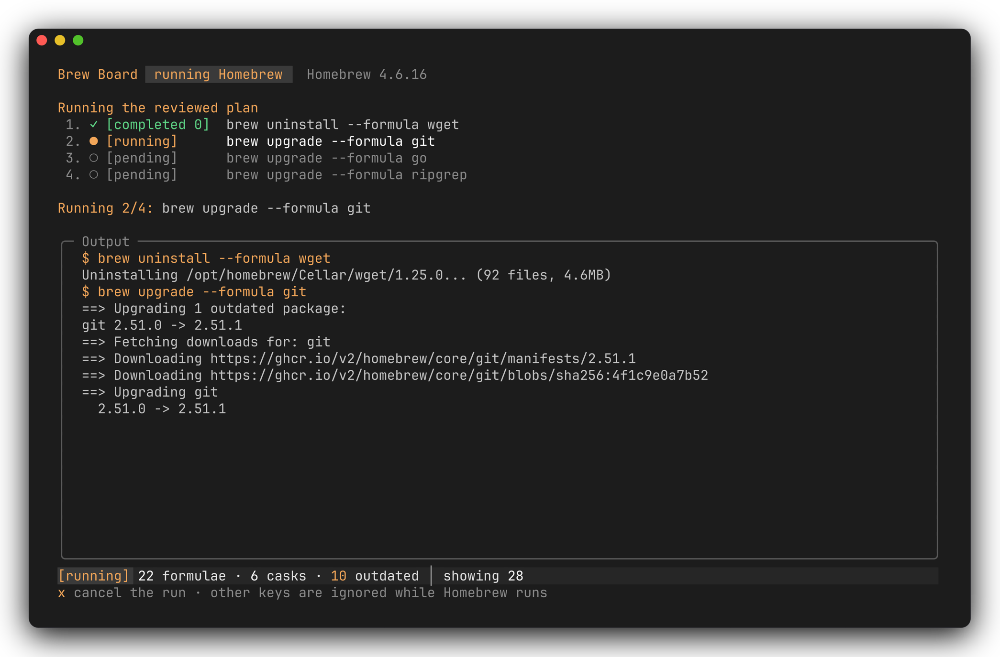
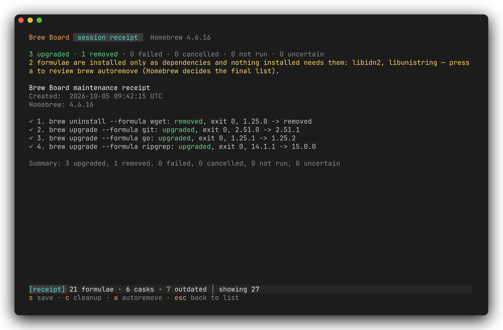

<div align="center">

# Brew Board

**A keyboard-first terminal interface for routine Homebrew maintenance.**
Inspect, stage, review the exact commands, run them, keep a receipt.

[](https://github.com/KaanEmec/brew-board/actions/workflows/ci.yml)
[](https://github.com/KaanEmec/brew-board/releases)
[](go.mod)




</div>

## Install

Requires macOS with Homebrew 4 or newer.

```sh
brew tap kaanemec/brew-board https://github.com/KaanEmec/brew-board && brew trust kaanemec/brew-board && brew install brewboard
```

The tap lives in this repository, so Homebrew cannot find it on its own; the URL in the first command is what makes it work. Homebrew 7 refuses formulae from third-party taps until you trust them, which is what `brew trust` does; it applies only to this tap.

<details>
<summary>Other ways to install</summary>

**With Go 1.27 or newer:**

```sh
go install github.com/kaanemec/brew-board/cmd/brewboard@latest
```

**From a release tarball** (Apple Silicon `arm64`, Intel `amd64`), verified against the published checksums:

```sh
VERSION=1.0.0 ARCH=arm64      # pick the release; use amd64 on Intel
BASE=https://github.com/KaanEmec/brew-board/releases/download/v$VERSION
curl -LO $BASE/brewboard_${VERSION}_darwin_${ARCH}.tar.gz
curl -LO $BASE/checksums.txt
grep "darwin_${ARCH}" checksums.txt | shasum -a 256 -c -    # must print: ...tar.gz: OK
tar -xzf brewboard_${VERSION}_darwin_${ARCH}.tar.gz
./brewboard --version
```

Move `brewboard` onto your `PATH`. The binary is not code-signed; if macOS blocks a browser-downloaded copy, check the checksum first, then run `xattr -d com.apple.quarantine brewboard`.

**From source:** `make build` produces `bin/brewboard`; `make check` runs gofmt, vet, golangci-lint and race tests.

</details>

## What it does

- **Inspect.** Lists installed formulae and casks, marks outdated and pinned ones, and shows what each package depends on and what requires it.
- **Stage.** Mark packages for upgrade or removal with a keystroke; `c` re-checks the marks against a fresh inventory.
- **Review the exact commands.** The review screen lists every `brew` command verbatim, removals first, with a plain-language note on each.
- **Execute with live output.** Nothing runs until you press `y`. Commands run one per package, in order, stop at the first failure, and can be cancelled.
- **Receipt, no hidden work.** A receipt reconciles every command against a reloaded inventory. Dependency rules block unsafe removals, and no update, autoremove or cleanup happens behind your back.

## A session in five screens

**1. List.** Browse, search and filter the inventory; mark outdated packages for upgrade and any unpinned package for removal.


**2. Details.** See versions, what a package depends on, and which installed packages require it.



**3. Review.** Every command is shown exactly as it will run; packages that changed or break the dependency rules are dropped, with the reason.



**4. Running.** Output streams live, one command at a time, and `x` asks to cancel.



**5. Receipt.** What was upgraded, removed, failed or not run, checked against a fresh inventory, with optional cleanup and autoremove reviews.



## Keyboard

Press `?` in the app for the same list.

| Key | Action |
| --- | --- |
| `j` / `k`, `↓` / `↑` | Move selection; scroll the other screens |
| `g` / `G`, `home` / `end` | First / last package |
| `pgdn` / `pgup`, `ctrl+d` / `ctrl+u` | Page down / up |
| `/` | Search name and description (`enter` keeps it, `esc` clears it) |
| `f` | Cycle type filter: all, formulae, casks |
| `o` | Toggle outdated-only |
| `r` | Refresh the inventory (read-only); on the receipt, retry a failed post-run refresh |
| `enter` | Package details |
| `esc`, `q`, `h`, `←`, `backspace` | Leave details |
| `space` | List: mark or unmark the highlighted outdated, unpinned package for upgrade |
| `d` | List: mark or unmark the highlighted unpinned package for removal |
| `a` | List: mark or unmark all visible outdated, unpinned packages for upgrade |
| `c` | List: continue; re-check the marks and open the review |
| `y` / `esc` | Review: run the listed commands / back to the list, marks kept |
| `x` / `ctrl+c` | Running: ask to cancel (`y` cancels, `n` or `esc` keeps running) |
| `s` | Receipt: save it to your home directory (mode 0600) |
| `c` | Receipt: review `brew cleanup` |
| `a` | Receipt: review `brew autoremove` (offered when dependency-only formulae are left over) |
| `esc` / `enter` | Receipt: back to the list, marks cleared |
| `?` | Toggle help |
| `q` / `ctrl+c` | Quit (while commands run, `ctrl+c` asks to cancel instead) |

## Safety guarantees

- **Nothing without `y`.** The only commands Brew Board runs are the read commands (`brew --version`, `brew info --json=v2 --installed`, `brew outdated --json=v2`) and the exact commands you reviewed and confirmed.
- **Exact commands.** Only these forms are ever run: `brew upgrade --formula|--cask <name>`, `brew uninstall --formula|--cask <name>`, and, after separate reviews, `brew cleanup` and `brew autoremove`.
- **Argv only.** Commands are executed directly, never through a shell.
- **Never `--force` or `--ignore-dependencies`.**
- **No hidden work.** Every `brew` call sets these environment variables:

  | Variable | Effect |
  | --- | --- |
  | `HOMEBREW_NO_AUTO_UPDATE=1` | No implicit `brew update` |
  | `HOMEBREW_NO_AUTOREMOVE=1` | `uninstall` and `cleanup` do not autoremove on their own |
  | `HOMEBREW_NO_INSTALL_CLEANUP=1` | `upgrade` does not clean up afterwards |
  | `HOMEBREW_NO_ENV_HINTS=1` | No hint text mixed into output |
  | `HOMEBREW_NO_COLOR=1`, `HOMEBREW_NO_EMOJI=1` | Plain output Brew Board can render reliably |

## Dependency rules

A package can be removed only if every installed package that needs it is removed in the same plan. For formulae that means every keg whose full runtime dependency closure includes it, the same check Homebrew makes before an uninstall. Otherwise the review drops it with "required by … — mark them for removal too, or keep …". Pinned formulae cannot be removed until you `brew unpin` them. Dependents are removed before their dependencies. Brew Board only previews dependency-only formulae; `brew autoremove` decides its own final list.

## Troubleshooting

| What you see | Cause | What to do |
| --- | --- | --- |
| `[error] Homebrew not found` | `brew` is not on `PATH` or in `/opt/homebrew`, `/usr/local` or `/home/linuxbrew/.linuxbrew` | Install Homebrew from https://brew.sh or add it to `PATH`, then press `r`. |
| `[error] Unsupported Homebrew version` | `brew` rejected `--json=v2` | Run `brew update` to get Homebrew 4.0 or newer, then press `r`. |
| `[error] Homebrew timed out` | A `brew` command took over 60 seconds, often because another brew process is running | Wait for it to finish, then press `r`. |
| `[error] brew command failed` | Homebrew itself failed | Run the same `brew` command in a terminal, fix it (try `brew doctor`), then press `r`. |
| `[error] Unreadable Homebrew output` | The JSON could not be parsed | Press `r`; if it persists, run `brew doctor`. |
| Receipt shows `NOT VERIFIED` and `uncertain` | The refresh after the run failed | Press `r` on the receipt; check packages with `brew info <name>`. |
| Receipt shows `failed, exit N` | A reviewed command failed; later ones did not run | Re-run it in a terminal, fix the cause, stage the rest again. |
| A cask has an update but no `↑` marker | `brew outdated` skips self-updating casks without `--greedy`, which Brew Board does not pass | Use the app's updater, or run `brew upgrade --cask --greedy <name>` yourself. |
| Banner stays at `[stale, refreshing…]` | A refresh is still waiting on `brew` | Wait about two minutes; it then becomes `[error]` with a reason. |

## Limitations

- macOS only; needs Homebrew 4 or newer with `--json=v2`. Tested with Homebrew 7.0.x on Apple Silicon. Intel Macs are untested; Linuxbrew is unsupported.
- Brew Board looks for `brew` on `PATH`, then `/opt/homebrew/bin`, `/usr/local/bin` and `/home/linuxbrew/.linuxbrew/bin`.
- Pinned packages cannot be marked. Self-updating casks are not reported as outdated.
- Upgrades are per package; Homebrew may upgrade dependencies as part of one. Dependencies are checked only for removals.
- No noninteractive mode, no `brew update`, no installs, no automatic cleanup or autoremove.
- Release binaries are not code-signed or notarized.

## More

[ARCHITECTURE.md](ARCHITECTURE.md) describes the technical shape, [CHANGELOG.md](CHANGELOG.md) the release history, and the [roadmap](roadmap/README.md) the version goals.
